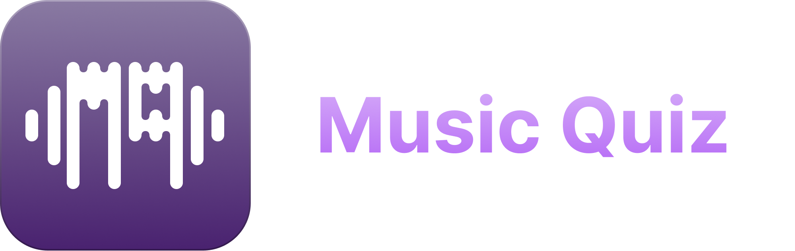
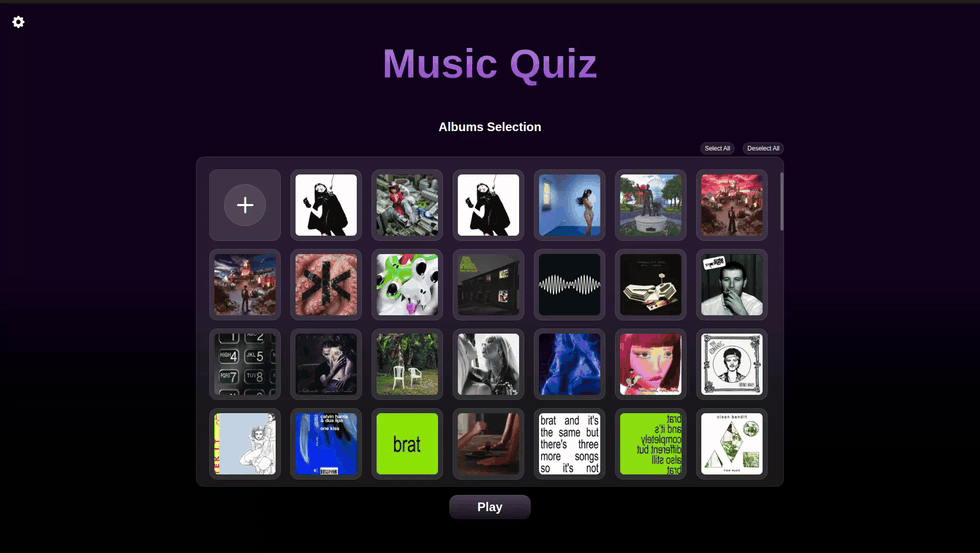
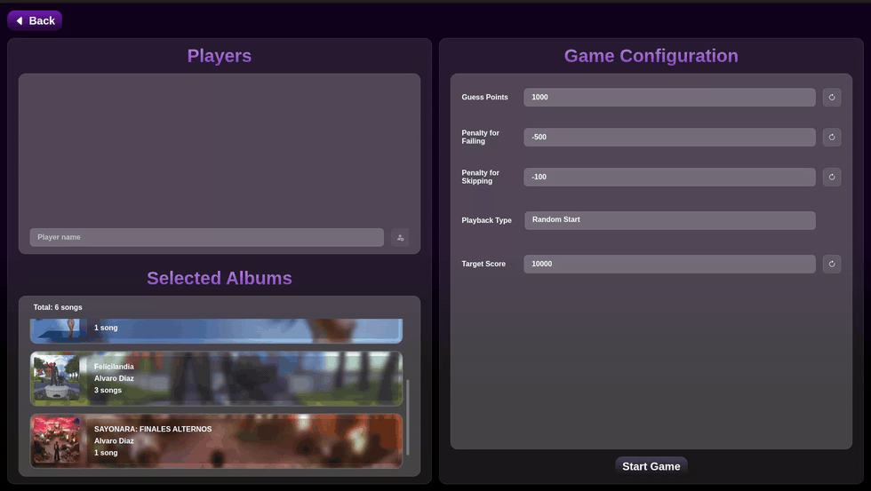
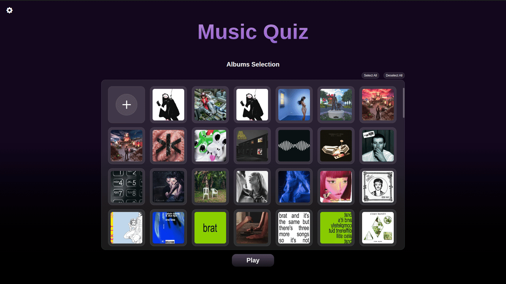
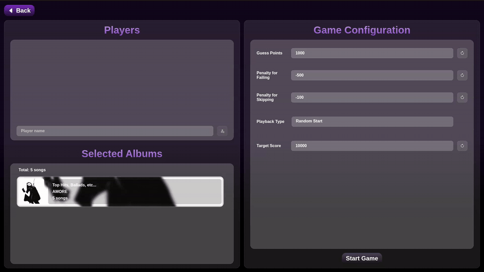
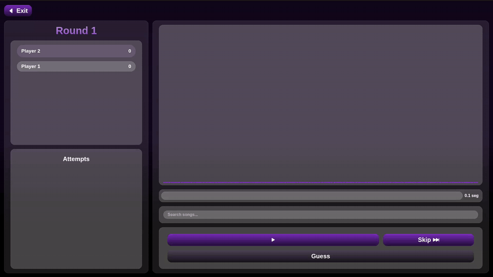
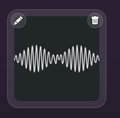
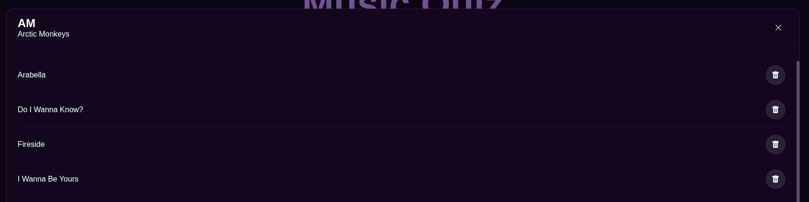
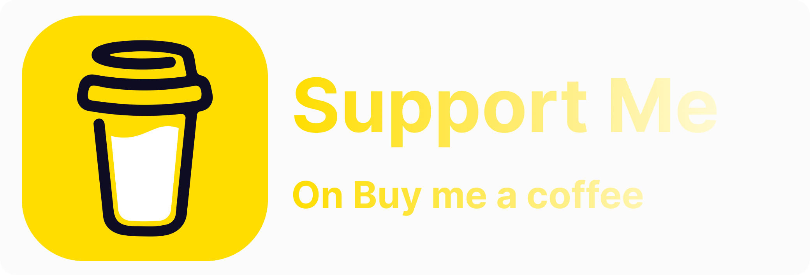

<h1 align="center">
    
</h1>

Music Quiz is a game where players can guess songs locally. It allows you to customise the game and play in multiplayer mode.

<p align="center">
    
    
    
    
    
    
    <br>
    <a href="https://buymeacoffee.com/rafaelmolln"></a>
</p>

## Features

### Upload your own music



You can select a folder containing songs with metadata to load them into the game. The game automatically sorts the selected songs by album and artist and displays them in the main menu for selection.

### Multiplayer



You can add as many players as you like to play with friends.

### Customize your game



Players can change the colour scheme to suit their preferences; the game dynamically adapts to the selected colour scheme.

### Game configuration



You can change the game settings; the following options are available:

- **Points for correct answers**
- **Penalty for incorrect answers**
- **Penalty for skipping**
- **Play mode**
- **Target score**

### Complete game UI



There is a comprehensive user interface where you can find: the list of players, the list of attempts, the audio spectrum and the song selector.

### Various languages supported

Languages supported:

- English (Great Britain)
- English (United States)
- Español (España)
- Español (Latinoamérica)
- Português *
- Português (Brasil) *
- Français *
- Deutsch *
- Italiano *
- Dansk *
- Български *
- Русский *
- 中文 (简体) *
- 中文 (繁體) *
- 日本語 *
- 한국어 *

> [!NOTE]
> Languages marked with * have not been completely checked; there may be some errors.

## Getting Started

To play the game, you’ll need to install it for your platform. Below are instructions on how to install the game on the various platforms.

### Linux Installation

To install the game on your system, you will need to download the `.deb` file and run the following command:

```shell
sudo dpkg -i MusicQuiz_<version>_amd64.deb
```

There is also an executable `.AppImage` version that does not require downloading; simply run the programme.

### Windows Installation

An executable `.exe` file is provided to run the programme.

### Mac Installation

A `.zip` file is provided, containing the `.app` programme, which must be moved to the `Applications` folder in order to run the programme.

## About

### Uploading Songs

Songs are uploaded by pressing the ‘+’ button on the home screen (at present, only songs in `mp3` format are supported). The game automatically organises the songs by album based on the songs’ [metadata](https://www.ibm.com/es-es/think/topics/metadata).

<div align="center">
    
</div>

The programme processes the following metadata:

- **Title**
- **Artist**
- **Album**
- **Duration**
- **Cover art**

If the programme cannot identify which album and artist a song belongs to, the songs will be saved in a generic album called `Unknown`.

> [!NOTE]
> When uploading songs, if any duplicate songs are found, they are skipped to avoid duplication. Songs with the same title but different album and artist are allowed.

### Remove Songs

To delete songs, hover the mouse over the album cover; two buttons will appear:

- **Edit button** (pencil icon): Displays the list of songs contained in the album. By clicking on the delete button (bin icon), you can delete the songs from the album.

- **Delete button** (bin icon): Deletes the album from the game.

<div align="center">
    
</div>

<div align="center">
    
</div>

### Game Mechanics

The aim of the game is to try and guess the random song from a selection across 5 levels:

- **Very Easy**: 0.1 sec
- **Easy**: 0.5 sec
- **Medium**: 1 sec
- **Difficult**: 5 sec
- **Very Difficult**: 10 sec

The player can skip to the next level or try to guess the song (each option updates the player’s score in real time. The number of points awarded can be adjusted in the game settings).

On all levels, players are allowed to skip to the next one except on the final level, where they must guess the song.

Upon guessing the song correctly or incorrectly, a menu will appear showing a summary of the round.

### Win Conditions

To win the game, any player must reach the target score (which can be set in the game settings).

When this happens at the end of the round summary, a game summary menu will appear showing the players’ scores and their positions relative to the others.

If there are no more songs left to play (as songs that have already been played are not repeated during the game), the game will end in the same way.

## [License](./LICENSE.md)

MIT License under Copyright (c) 2026 Rafael Molleja Jiménez

_This game was made and designed by a human_

<div align="center"><a href="https://buymeacoffee.com/rafaelmolln"></a></div>
